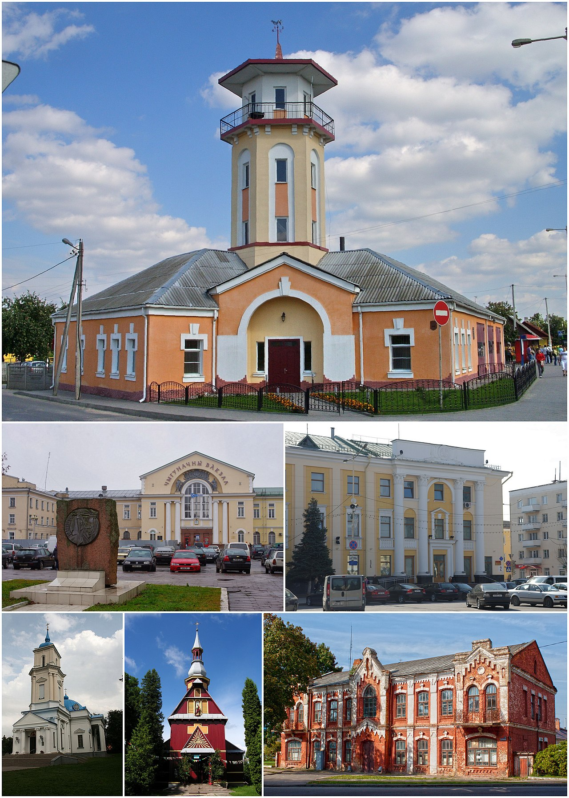

Расположен на Барановичской равнине в междуречье Щары и её притока Мышанки. Барановичи находятся практически на прямой, соединяющей областной центр Брест (206 км) и столицу Белоруссии Минск (149 км). Ближайшие города: Ляховичи (17 км), Слоним (42 км), Новогрудок (52 км), Лида (98 км), Волковыск (113 км). Барановичи лежат на равнинной местности, где перепад высот не превышает 20 м (от 180 до 200 м над уровнем моря). Высота города над уровнем моря составляет 193 м. Протяжённость города — 7 км как с запада на восток, так и с севера на юг; вместе с тем город несколько вытянут (на 8,5 км) в направлении с юго-запада (от ул. Брестской) на северо-восток (до ул. Фабричной) и сжат (6,3 км) в направлении с севера (ул. Советская) на юго-восток (ул. Фроленкова). Площадь, занимаемая городом, равна 80,66 км² (8066 га, (12 августа 2012 года). Плотность населения составляет более 2000 человек на кв. км.

Самая северная точка города — улица Королика, расположенная севернее завода автоматических линий — 53°10' с. ш., южная — д. Узноги, 53°06' с. ш. Крайняя западная точка располагается в районе улицы Бадака — 25°57' в. д. , восточная — в районе пересечения улиц Егорова и Каштановой — 26°04' в. д. Геометрический центр города — площадь Ленина. Всего в городе около пятисот улиц и переулков общей длиной 252,8 км, из них благоустроенных — 129,8 км, освещённых — 240 км.

Барановичи характеризуются очень выгодным географическим положением и являются крупным узлом важнейших железных и шоссейных дорог. Здесь близкое расположение магистрального газопровода, развитая система энерго- и водоснабжения, благоприятный климат. В городе расположен ряд крупных промышленных предприятий.

По данным на середину 2007 года, на 1000 жителей города приходится 265 единиц транспортных средств. Всего в городе их зарегистрировано 56 641 транспортных единиц.

Город Барановичи не только один из крупнейших городов Белоруссии по численности населения (восьмое место в республике), но и один из важнейших промышленных, культурных и образовательных центров Белоруссии.

У Барановичей на начало 2010 года имеется 21 город-побратим, среди которых российские Мытищи (Подмосковье), Василеостровский район Санкт-Петербурга, финский Хейнола, австрийский Штоккерау, польские Бяла-Подляска, Гдыня, повет Суленцин, китайский Пуци, итальянская Феррара, латвийская Елгава, украинские Полтава, Нововолынск и другие.

